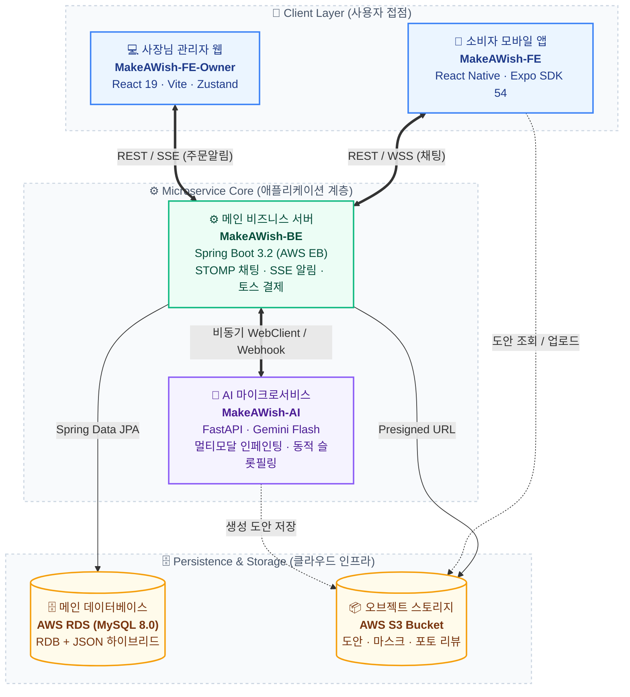

# 🎂 MakeAWish: Custom Cake O2O Commerce Platform

  
  
  
  
  
  

MakeAWish(메이크어위시)는 수제 맞춤형 케이크 주문 과정에서 발생하는 상담 피로도와 제작 소통 미스를 해결하기 위한 O2O 커머스 플랫폼입니다. 소비자의 자연어 요청을 분석하는 대화형 주문서 생성, 케이크 실물 질감을 보존하는 도안 인페인팅, 소상공인용 실시간 주문 관리 웹 및 선결제 에스크로 시스템을 제공합니다.

---

## 🏗 전체 시스템 아키텍처 (System Architecture)

---

## 📦 서브 프로젝트 저장소 개요

| 프로젝트 디렉토리 | 담당 플랫폼 및 역할 | 핵심 기술 스택 | 세부 README |
| :--- | :--- | :--- | :---: |
| **`MakeAWish-FE`** | **소비자 모바일 앱** (탐색, AI 도안 생성, 결제, 1:1 상담) | React Native 0.76, Expo SDK 54, Expo Router v3, NativeWind v4, Naver Map SDK, Toss Payments | [바로가기](./MakeAWish-FE/README.md) |
| **`MakeAWish-FE-Owner`** | **사장님 관리자 웹** (실시간 주문 칸반, 동적 스키마 빌더, AI 답글) | React 19, Vite, Zustand, Tailwind CSS, SSE (`text/event-stream`), Recharts | [바로가기](./MakeAWish-FE-Owner/README.md) |
| **`MakeAWish-BE`** | **메인 API 오케스트레이터** (주문 무결성, 하버사인 반경 검색, 결제 멱등성) | Java 17, Spring Boot 3.2, Spring Security 6, JPA/Hibernate, MySQL 8.0, STOMP WS | [바로가기](./MakeAWish-BE/README.md) |
| **`MakeAWish-AI`** | **AI 마이크로서비스** (동적 슬롯필링, 실물 질감 보존 인페인팅, 3단계 파서) | Python 3.10+, FastAPI, Pydantic v2, Google Gemini 3.5 Flash, Gemini 멀티모달 Inpainting | [바로가기](./MakeAWish-AI/README.md) |

---

## 🔄 End-to-End 핵심 주문 라이프사이클

1. **도안 생성 & 슬롯필링**: 소비자가 모바일 앱에서 자연어로 요청하면 AI(FastAPI)가 매장 고유의 주문서 양식(`custom_schema`)에 맞추어 필수 옵션을 추출하고 주문 요약 카드를 생성합니다.
2. **실시간 주문 접수**: 사장님 관리자 웹은 SSE(`SseEmitter`)를 통해 페이지 새로고침 없이 즉시 칸반 보드 [신규 주문] 컬럼에 주문 카드를 수신합니다.
3. **추가금 산정 & 견적 발송**: 사장님이 도안 난이도 및 요청사항을 확인한 후 작업 추가금을 책정하여 최종 견적서를 발송합니다.
4. **토스페이먼츠 선결제**: 소비자 앱의 1:1 상담 채팅방에 견적 카드가 갱신되며, 인앱 웹뷰 브릿지를 통해 토스페이 선결제를 진행합니다.
5. **제작 착수 & 노쇼 방지**: 결제 완료 상태(`PAID`)를 확인한 사장님이 안심하고 제작(`MAKING`)에 착수하여 노쇼를 원천 차단합니다.
